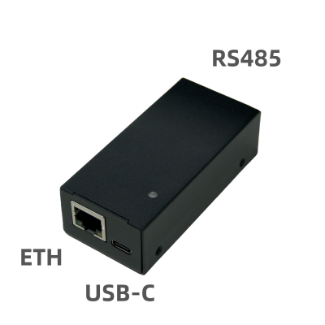
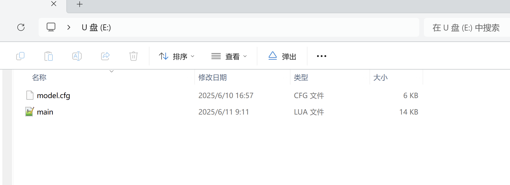
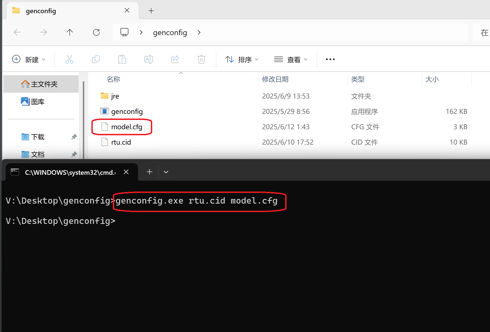

# 61850 Converter User Guide


## Preface

This protocol converter is very easy to use. By following the content in this document, you will be able to operate the 61850 protocol converter. Based on your actual needs, you can then implement one or more of the following features: telemetering (analog input acquisition), telesignalling (binary input acquisition), telecontrol (binary output control), and setpoint adjustment (parameter setting).

> The entire configuration process only requires a USB Type‑C cable to connect to a computer. Then drag the modified `main.lua` and `model.cfg` files into the converter.


**Contact**

- Webchat: stdlib-h
- Website: https://flexlua.com
- Email: shineblink666@gmail.com




### 1. Introduction to `main.lua` and `model.cfg`

After connecting the converter to your computer with a USB Type‑C cable, a 1.6 MB USB drive will automatically mount. Inside the drive, you will find two key files: `main.lua` and `model.cfg`:



> `main.lua`: A script file written in the Lua programming language. The specific 61850 protocol conversion logic is defined in `main.lua`. To implement custom 61850 data conversion, simply edit the Ethernet configuration, the 61850 data point lists (Y?_List), and the Modbus data point list (MB_List) at the top of the file.
>
> `model.cfg`: A file generated by converting an IED description file (`.cid`) of a 61850 device. The converter only recognizes the `model.cfg` format, so you must convert the `.cid` file to `model.cfg`. The following sections describe how to generate `model.cfg`.


### 1.2 Configure Ethernet information in `main.lua`

Modify the following in `main.lua` according to your network environment.

```lua
-- IEC61850 Ethernet interface configuration
mac = {0x00, 0x00, 0x00, 0x00, 0x00, 0x00} -- Device MAC address (use the chip's globally unique MAC when all bytes are 0x00)
ip = {192, 168, 0, 111} -- Device IP address
subm = {255,255,255,0} -- Subnet mask
gw = {192, 168, 0, 1} -- Gateway address
dns = {8,8,8,8} -- DNS address
port = 102 -- Local port (61850 server)
```


### 1.3 Configure 61850 data point information in `main.lua` (Y?_List)

For example, the `YC_List` in `main.lua` defines two 61850 data points for a temperature and humidity sensor. `GGIO` and `mag.f` are standard data types defined in IEC 61850-7-3 and IEC 61850-7-4, and can be used to represent floating-point values in telemetering (analog input acquisition). You can modify `YC_List` to implement more complex telemetering functions.

```lua
-- IEC61850 telemetering data point definitions
YC_List = 
{
	-- Sensor #1 (temperature & humidity)
	{"RTU/GGIO1.AnIn1", ".mag.f", "FLOAT32"}, -- Floating-point value, humidity
	{"RTU/GGIO1.AnIn2", ".mag.f", "FLOAT32"}  -- Floating-point value, temperature
}
```

- `YC_List`: Defines data point properties for telemetering (analog input acquisition)
- `YX_List`: Defines data point properties for telesignalling (binary input acquisition)
- `YK_List`: Defines data point properties for telecontrol (binary output control)
- `YT_List`: Defines data point properties for setpoint adjustment (parameter setting)

For detailed methods of constructing the 61850 data point lists for telemetering, telesignalling, telecontrol, and setpoint adjustment, please refer directly to the provided examples.


### 1.4 Configure Modbus data point information in `main.lua` (MB_List)

For example, the `MB_List` in `main.lua` defines two Modbus data points for a temperature and humidity sensor, as well as the RS485 Modbus communication parameters. You can modify `MB_List` to implement more complex telemetering functions.

```lua
-- Modbus telemetering data point definitions
MB_List = 
{
	-- Sensor #1 (temperature & humidity)
	{
		-- 4800 bps, no parity, 1 stop bit, function code "03", address 0x01, response timeout 100 ms, inter-packet interval 1000 ms
		com = {"BAUDRATE_4800","NoneParity","StopBit_1","03",0x01,100,1000},  
		data = 
		{
			{"RTU/GGIO1.AnIn1",0x0000,"S_AB",1}, -- Humidity, 1 decimal place (actually S_AB integer × 0.1)
			{"RTU/GGIO1.AnIn2",0x0001,"S_AB",1}  -- Temperature, 1 decimal place (actually S_AB integer × 0.1)
		}
	}
}
```

`MB_List` defines the data point properties of Modbus devices. Note: The entries defined in `MB_List` must correspond one-to-one with the items defined in the four Y?_List lists introduced above. For the specific correspondence rules, refer to the later sections on telemetering, telesignalling, telecontrol, and setpoint adjustment.

For detailed methods of constructing Modbus data point lists for telemetering, telesignalling, telecontrol, and setpoint adjustment, please refer directly to the provided examples.


### 1.5 Build a `.cid` description file and convert it to `model.cfg` with one click

In each example folder we provide, you will find an `rtu.cid` file. It is a CID file fully compliant with the 61850 standard, describing the complete data model and instance definitions of the device. You can use this file as a template and modify it to implement more complex telemetering, telesignalling, telecontrol, and setpoint functions. After editing `rtu.cid`, use the `genconfig.exe` conversion tool we provide to convert the `.cid` description file into `model.cfg` with one command.

**How to use the `genconfig.exe` conversion tool:**

Unzip the `genconfig.zip` package we provide to create the `genconfig` folder. Drag `rtu.cid` into this folder. In the blank area of the folder, hold Shift and right‑click to open a PowerShell terminal, then run the command `genconfig.exe rtu.cid model.cfg`. A `model.cfg` file will be generated in the `genconfig` folder:




### 1.6 Run

Finally, drag the modified `main.lua` and `model.cfg` files into the converter’s USB drive. After unplugging the USB Type‑C cable, the converter’s green LED (while powered) will blink for one second, indicating that the Lua script compiled successfully and is now running.

> Note: If the red LED stays on, it indicates a syntax error in the `main.lua` script. Reconnect the USB Type‑C cable, open the `log.txt` file in the USB drive to check the error details and the specific line, then fix the syntax error in `main.lua` and try again.

