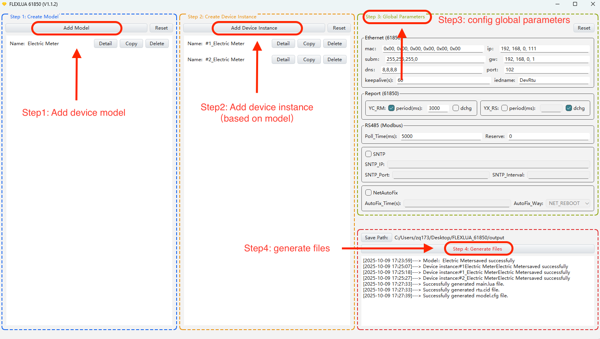
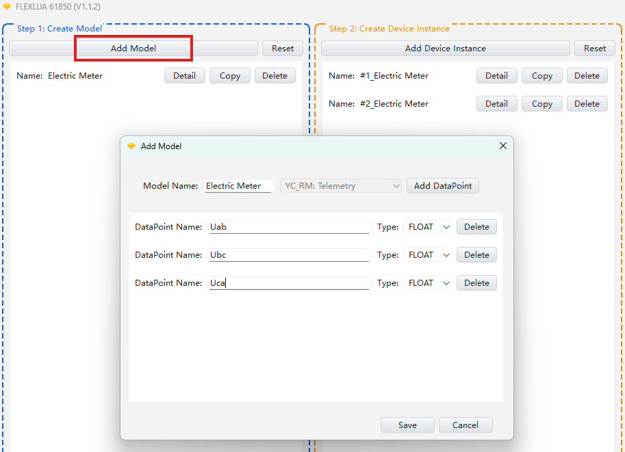
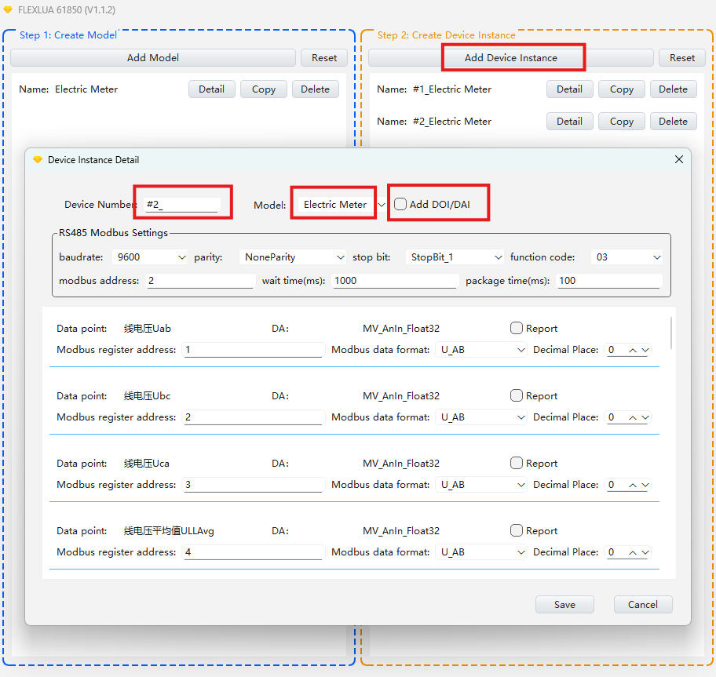
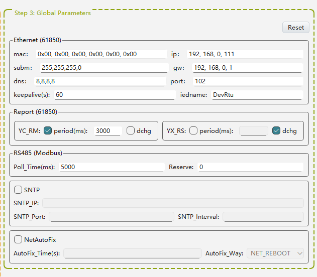
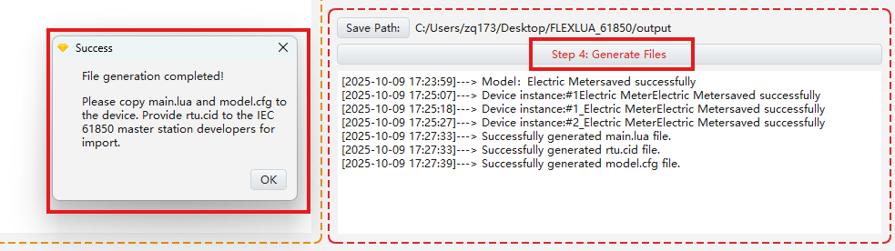
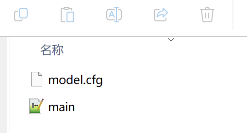
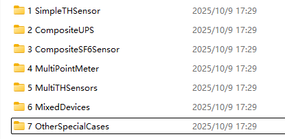

# IEC 61850 Converter User Guide

[TOC]

## 1. Configuration Process Overview


Extract the `FlexLua_61850_Config_Tool.zip` archive. Please do not extract it to the C drive, then run FLEXLUA_61850.exe. The usage flow is as follows:





## 2. Detailed Configuration Process


### (1) Create Device Model





Click the "**Add Model**" button and fill in the following items in the pop-up dialog:
 - Device Name
 - Select Model Type, for example: select YC_RM for analog value acquisition, YX_RS for switch status acquisition, YK_RM for remote control, and YT_RR for remote adjustment
 - Add Data Points, give each data point a name for easy identification, and set the data type (FLOAT/INT/BIT) for each data point

 > Note 1: If a device needs to acquire both analog values and switch status, two device models need to be created

 > Note 2: Data type selection follows these principles:
 > - If you need to report floating-point decimals to the IEC 61850 master station, select FLOAT
 > - If you need to report integers to the IEC 61850 master station, select INT
 > - If you need to report switch signals to the IEC 61850 master station, select BIT


### (2) Add Device Instance





Click the "**Add Instance**" button and fill in the following items in the pop-up dialog:

- **Create Instance Name:** Select the device model we created earlier, for example, the "Electric Meter" model. Then manually enter the device number, such as: "No. 1", "No. 2", "Distribution Room No. 1", "Distribution Room No. 2", etc. The complete device instance name is formed by combining the device number and model name, such as "Electric Meter No. 1", "Electric Meter in Distribution Room No. 1", etc. Additionally, if you need the master station to see the complete name of each data point, you can check the `DOI/DAI` option, which will create DAI instance names for all data points under this device.

- **Configure RS485 Communication Parameters:** Set the RS485 communication parameters for the device instance (such as `baudrate`, etc.). Note that the `wait time(ms)` parameter is generally set to the default 1000 milliseconds, which is sufficient for most scenarios. It is used as the maximum time to wait for a response from the RS485 device. If the RS485 device response time is very slow and exceeds 1000 milliseconds, causing RS485 communication timeout, increasing this value can solve the problem. `package time(ms)` is used to set the minimum interval time between two communications during RS485 communication to avoid polling devices on the RS485 bus too frequently. Generally, 100 milliseconds is sufficient.

- **Configure Each Data Point:** Fill in the register address/coil address and set the data format of the data point in Modbus-RTU communication (U_AB/S_AB/F_ABCD/BIT, etc.). For example, "U_AB" represents a 16-bit unsigned integer, "S_AB" represents a 16-bit signed integer, and "F_ABCD" represents a 32-bit floating-point number. For more data formats, please refer to the "Modbus Data Type Definition" document. Finally, set the number of decimal places to be retained for this data point, which users can set according to actual needs. It is particularly important to note that some Modbus RS485 manufacturers take shortcuts by using integers (such as U_AB, UL_ABCD) instead of the standard F_ABCD Float type to represent decimals. For example, they may indicate in the manual that the integer needs to be divided by 10 to represent 0.1. We have already considered this situation. Users only need to select the integer type such as "U_AB" normally, and then directly set the decimal places to 1, which will automatically convert to a floating-point number with 1 decimal place.

> **Tips for Creating Multiple Identical Devices:**
> After creating one device instance, you can click the "Copy" button, so you only need to fill in the "device number" and "modbus address" for the new device to quickly create a new device instance. For example, after creating the "Electric Meter No. 1" device instance based on the "Electric Meter" model, you can easily create "Electric Meter No. 2", "Electric Meter No. 3", "Electric Meter No. 4" through the copy method.

> **Enable Data Point IEC 61850 Reporting Function:** Each data point has a `Report` checkbox. When checked, this data will be reported in IEC 61850. For example, periodic fixed-interval reporting, or triggered reporting when data changes. For specific reporting configuration methods, please refer to the next chapter about the `Report(61850)` device parameter introduction. Note: When there are a large number of data points, it is recommended not to check reporting for every data point, as this will cause network communication burden.


### (3) Configure Device Parameters




#### Configure IEC 61850 Ethernet Network Parameters: Ethernet(61850)

 - mac: Set own MAC address. When all filled with 0x00, the globally unique MAC address of the Ethernet driver chip itself will be used
 - ip: Set own IP address
 - subm: Set subnet mask
 - gw: Set gateway IP address
 - dns: Set DNS server IP address
 - port: Set own port number. IEC 61850 is generally set to 102
 - keepalive: Set TCP keepalive time. Generally set to the default 60 seconds. When no keepalive information is received from the IEC 61850 master station for more than 60 seconds, it will actively disconnect the TCP connection with the disconnected master station. This is beneficial for the protocol converter to promptly disconnect invalid TCP connections and wait for new TCP connection requests.
 - iedname: Used to set the iedname that the master station can see. It is recommended not to exceed 8 letters


#### Configure IEC 61850 Data Reporting Trigger Mode and Frequency: Report(61850)

 Currently, only YC_RM (Telemetry: report analog values) and YX_RS (Telesignalling: report switch status) support IEC 61850 reporting configuration:
 - When `period(ms)` is checked and this value is set to 3000, it means that all telemetry/telesignalling data points that have been checked for `Report` will automatically report data every 3000 milliseconds
 - When `dchg` is checked, it means that all telemetry/telesignalling data points that have been checked for reporting will automatically report data once when their values change
> Recommendation: Telemetry data is continuous analog data. It is recommended to only check `period(ms)` for periodic reporting. The reporting interval can also be set to a value larger than the default 3000, such as 60000 (60 seconds). Telesignalling data is switch-type data. It is recommended to use the default setting of only checking `dchg` for data change-triggered reporting.


#### Configure RS485 Modbus Maximum Polling Time Interval: RS485(Modbus)

`Poll_Time(ms)` is set to 5000 by default, which means that every 5 seconds, our IEC 61850 protocol converter will automatically poll all data points under all Modbus device instances we added through RS485 Modbus communication. However, if we have added a very large number of device instances or data points, and 5 seconds may not be enough to poll once, the polling interval time should be based on the actual situation. Most application scenarios should not exceed the default 5 seconds. Of course, if our data changes very slowly and there is no need for frequent polling, we can increase this value, such as 60000 (60 seconds) or even larger values for some temperature devices in actual application scenarios where changes are very slow.


#### Configure Time Synchronization Function: SNTP

When `SNTP` is checked, the SNTP time synchronization function of this protocol converter will be enabled:
- Fill in the IP address of the SNTP server in `SNTP_IP`
- Fill in the port number of the SNTP server in `SNTP_Port`, which is generally 123 by default
- Fill in the frequency of requesting time from the SNTP server in `SNTP_Internal` (unit: seconds). Generally, 60 seconds is sufficient


#### Configure Network Auto-Recovery Function: NetAutoFix

When `NetAutoFix` is checked, the network auto-recovery function of this protocol converter will be enabled. For example, setting `AutoFix_Time` to 7200 and `AutoFix_Way` to "SYS_REBOOT" defines that if no messages are received from the peer for 7200 consecutive seconds, this device will automatically reboot (including the Ethernet card chip). This strategy is different from the keepalive above. It is a higher-level monitoring strategy at the application layer, monitoring whether the IEC 61850 master station has communicated with this protocol converter at the IEC 61850 level Ethernet TCP data transmission and reception within 7200 seconds. If it is not detected for 7200 consecutive seconds, this protocol converter will automatically perform device reset and restart as well as Ethernet TCP communication re-initialization configuration.
```
Some matters to note about the NetAutoFix function:

1. The NetAutoFix function is not necessary, and may even need to be disabled, for example, when the IEC 61850 master station is manually set not to communicate with this protocol converter for 7200 consecutive seconds, which is also a normal situation.

2. The NetAutoFix function cannot solve all network disconnection situations, for example, when the IEC 61850 master station itself has Ethernet TCP network communication problems, or when there are switch network problems.

3. The NetAutoFix function is somewhat like a watchdog for the device's own IEC 61850 communication, used to ensure that the device can restore network communication in time when problems occur (the probability of this situation is also very low, at least has not been encountered so far, so NetAutoFix is not checked by default in our configuration software).

4. If users feel that adding NetAutoFix protection would be more reassuring, that's fine too, but before adding it, you need to work with the IEC 61850 master station designers to ensure that the communication interval between the master station and this protocol converter will not exceed the set time (such as 7200 seconds).
```


### (4) Generate Files and Download




**Generate Files**

Finally, click the `Generate Files` button, which will automatically generate three files: `main.lua`, `model.cfg`, and `rtu.cid`. The `main.lua` and `model.cfg` files are used to download to the protocol converter for operation, while `rtu.cid` is provided to IEC 61850 master station developers for device import.


> Supplementary Note 1: `main.lua` is script code that follows Lua programming language syntax based on the FlexLua C2M MCU chip. It contains the complete IEC 61850 protocol converter function implementation source code. If users are not very familiar with programming, there is no need to read it. Just put it into the protocol converter and run it.


> Supplementary Note 2: `model.cfg` is actually a machine code file that can be recognized by the protocol converter, converted from the `rtu.cid` file through the genconfig conversion tool in the folder where the configuration tool is located. The two are essentially the same thing (both contain IEC 61850 CID file content), but one is provided for the protocol converter to run, and the other is provided for IEC 61850 master station developers to import devices.


**Download**

After connecting the protocol converter to the computer with a USB Type-C data cable, a 1.6M size USB drive will automatically pop up on the computer. Drag the `main.lua` and `model.cfg` files into the USB drive, then unplug the USB Type-C data cable. The green light of the protocol converter (with 12V power supply) will light up for about one second, indicating that the Lua source code has been successfully compiled and downloaded to the protocol converter.





**Download Failure Problem Diagnosis**

If the red light of the protocol converter is always on after downloading the file, it means that the `main.lua` source code may have syntax errors. At this time, you need to re-plug in the USB Type-C data cable, open the log.txt log file in the USB drive, check the reason and specific location of the error, then correct the syntax errors in the `main.lua` script code and try again. However, if you are using the `main.lua` file automatically generated by our configuration tool software, there should generally be no syntax error problems. This problem may occur when users manually modify the `main.lua` source code file, causing it not to comply with the Lua programming language syntax specifications.


## 3. Case Projects (For Learning and Reference)

Using the case projects we provide for learning and reference is the fastest way to get started. We provide a total of 6 case projects:




| Case Name                                          | Case Introduction                                                                        | Case Typicality                                                                                                                |
| -------------------------------------------------- | ---------------------------------------------------------------------------------------- | ------------------------------------------------------------------------------------------------------------------------------ |
| 1. Acquire a Simple Device (Temperature-Humidity Sensor) | Acquire 2 analog values from 1 temperature-humidity sensor: temperature and humidity values | Temperature-humidity sensor only contains: 2 analog values (03 Read Holding Registers)                                         |
| 2. Acquire a Composite Device (UPS Power Supply)   | Acquire 6 analog values and 64 switch status values from 1 UPS power supply device       | UPS power supply device contains both: 6 analog values (03 Read Holding Registers) and 64 switch values (02 Read Discrete Inputs) |
| 3. Acquire a Composite Device (SF6 Sensor)         | Acquire 6 analog values and 8 switch status values from 1 SF6 sensor                     | SF6 sensor not only contains: 6 analog values and 8 switch values, but specifically, its switch information is located in a certain bit of a 16-bit register in the analog value (03 Read Holding Registers) area |
| 4. Acquire a Multi-Data Point Device (Electric Meter) | Acquire 30 analog values from 1 electric meter                                           | Electric meter contains: 30 analog values (03 Read Holding Registers)                                                          |
| 5. Acquire Multiple Devices of the Same Type (10 Temperature-Humidity Sensors) | Simultaneously acquire 10 temperature-humidity sensors                                   | Demonstrates how to simultaneously acquire 10 identical devices                                                                |
| 6. Acquire Multiple Devices of Different Types (Temperature-Humidity Sensor + Electric Meter) | Simultaneously acquire 2 different devices (temperature-humidity sensor + electric meter) | Demonstrates how to simultaneously acquire multiple different devices                                                          |


