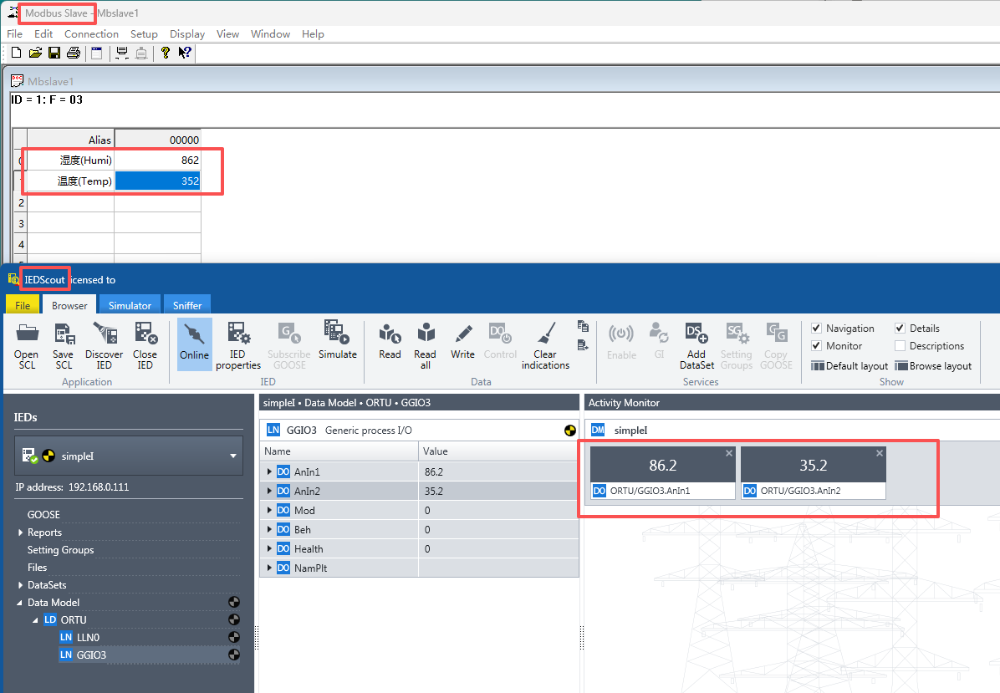

# Case Introduction (Temperature & Humidity Sensor)

## 1. Function Implementation
Collect data from a simple RS485 interface temperature and humidity sensor, and report to the 61850 master station.

## 2. Device RS485 Communication Parameters

Temperature & Humidity Sensor No.1: 4800 baud, no parity, 1 stop bit

## 3. Device Modbus Data Point Table

### The following data points use Modbus 03 Read Holding Registers function code
|Data Point Address|Name|Modbus Data Type|Additional Notes|61850 Data Type|
|:----|:----|:----|:----|:----|
|0000H|Humidity|S_AB (16-bit signed integer)|Integer divided by 10, unit: 0.1%| YC_RM Telemetry-Float|
|0001H|Temperature|S_AB (16-bit signed integer)|Integer divided by 10, unit: 0.1 degree| YC_RM Telemetry-Float|

## 4. How to Use This Case

- Copy the init folder in this case to completely overwrite the init folder in the FLEXLUA_61850 software directory, then click Generate in Step 4 of the software to generate the required 3 files (main.lua, model.cfg, rtu.cid).
- The main.lua and model.cfg files need to be placed into the protocol converter through the USB-C port. The rtu.cid file can be provided to 61850 master station developers for device import.

## 5. Testing

In the test folder of this case, there is a modbus slave device simulation file. If you have modbus slave and IEDScout testing tool software installed on your computer, they can be used to simulate modbus slave devices and 61850 master station software respectively to complete testing.

