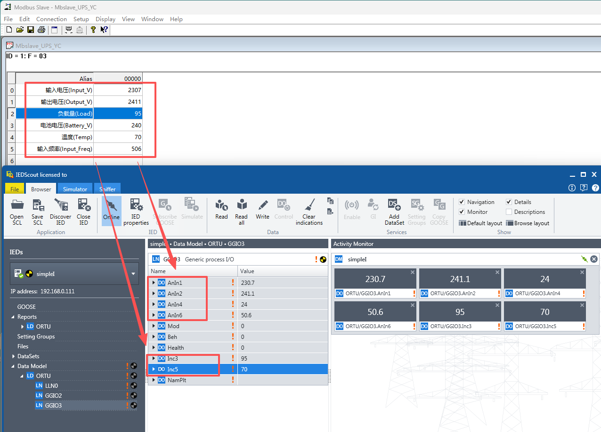
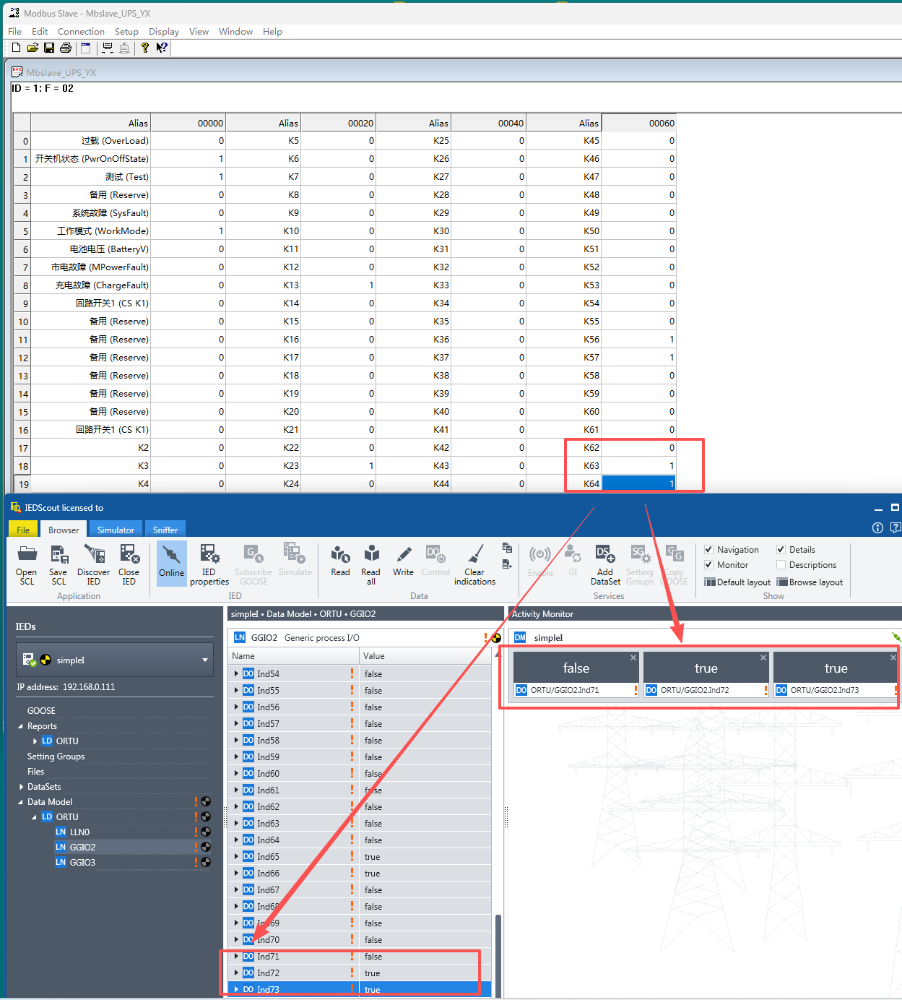

# Case Introduction (UPS Power Supply)

## 1. Function Implementation

Collect data from a relatively complex RS485 interface UPS (Uninterruptible Power Supply) device, and report to the 61850 master station.
> This UPS device contains two types of data points: telemetry type (integer or floating point) and telesignaling type (status bit 0/1), so we need two device models: YC_RM telemetry and YX_RS telesignaling.

## 2. Device RS485 Communication Parameters

UPS Device No.1: 9600 baud, no parity, 1 stop bit

## 3. Device Modbus Data Point Table

### The following data points use Modbus 03 Read Holding Registers function code

|Data Point Address|Name|Modbus Data Type|Additional Notes|61850 Data Type|
|:----|:----|:----|:----|:----|
|0000H|Input Voltage|U_AB (16-bit unsigned integer)|Integer divided by 10, unit: 0.1V| YC_RM Telemetry-Float|
|0001H|Output Voltage|U_AB (16-bit unsigned integer)|Integer divided by 10, unit: 0.1V| YC_RM Telemetry-Float|
|0002H|Load|U_AB (16-bit unsigned integer)|Unit: 1%| YC_RM Telemetry-Integer|
|0003H|Battery Voltage|U_AB (16-bit unsigned integer)|Integer divided by 10, unit: 0.1V| YC_RM Telemetry-Float|
|0004H|Temperature|S_AB (16-bit signed integer)|Unit: ℃| YC_RM Telemetry-Integer|
|0005H|Input Frequency|U_AB (16-bit unsigned integer)|Integer divided by 10, unit: 0.1Hz| YC_RM Telemetry-Float|

### The following data points use Modbus 02 Read Discrete Inputs function code

|Coil Address|Name|Modbus Data Type|Additional Notes|61850 Data Type|
|:----|:----|:----|:----|:----|
|0000H|Overload|Bool|0-Normal 1-Overload| YX_RS Telesignaling-Switch|
|0001H|Power State|Bool|0-On 1-Off| YX_RS Telesignaling-Switch|
|0002H|Test|Bool|0-Normal 1-Test| YX_RS Telesignaling-Switch|
|0003H|Reserved|Bool| |  |
|0004H|System Fault|Bool|0-Normal 1-System Fault| YX_RS Telesignaling-Switch|
|0005H|Working Mode|Bool|0-Inverter 1-Bypass| YX_RS Telesignaling-Switch|
|0006H|Battery Voltage|Bool|0-Normal 1-Battery Low| YX_RS Telesignaling-Switch|
|0007H|Mains Fault|Bool|0-Normal 1-Mains Fault| YX_RS Telesignaling-Switch|
|0008H|Charging Fault|Bool|0-Normal 1-Charging Fault| YX_RS Telesignaling-Switch|
|0009H-000FH|Reserved|Bool| |  |
|0010H|Circuit Switch 1|Bool|0-Open 1-Closed| YX_RS Telesignaling-Switch|
|0011H|Circuit Switch 2|Bool|0-Open 1-Closed| YX_RS Telesignaling-Switch|
|...||| |  |
|004EH|Circuit Switch 63|Bool|0-Open 1-Closed| YX_RS Telesignaling-Switch|
|004FH|Circuit Switch 64|Bool|0-Open 1-Closed| YX_RS Telesignaling-Switch|

## 4. How to Use This Case
- Copy the init folder in this case to completely overwrite the init folder in the FLEXLUA_61850 software directory, then click Generate in Step 4 of the software to generate the required 3 files (main.lua, model.cfg, rtu.cid).
- The main.lua and model.cfg files need to be placed into the protocol converter through the USB-C port. The rtu.cid file can be provided to 61850 master station developers for device import.

## 5. Testing

In the test folder of this case, there are modbus slave device simulation files. If you have modbus slave and IEDScout testing tool software installed on your computer, they can be used to simulate modbus slave devices and 61850 master station software respectively to complete testing.

### Read Registers (Telemetry) Test Results

### Read Coils (Telesignaling) Test Results

