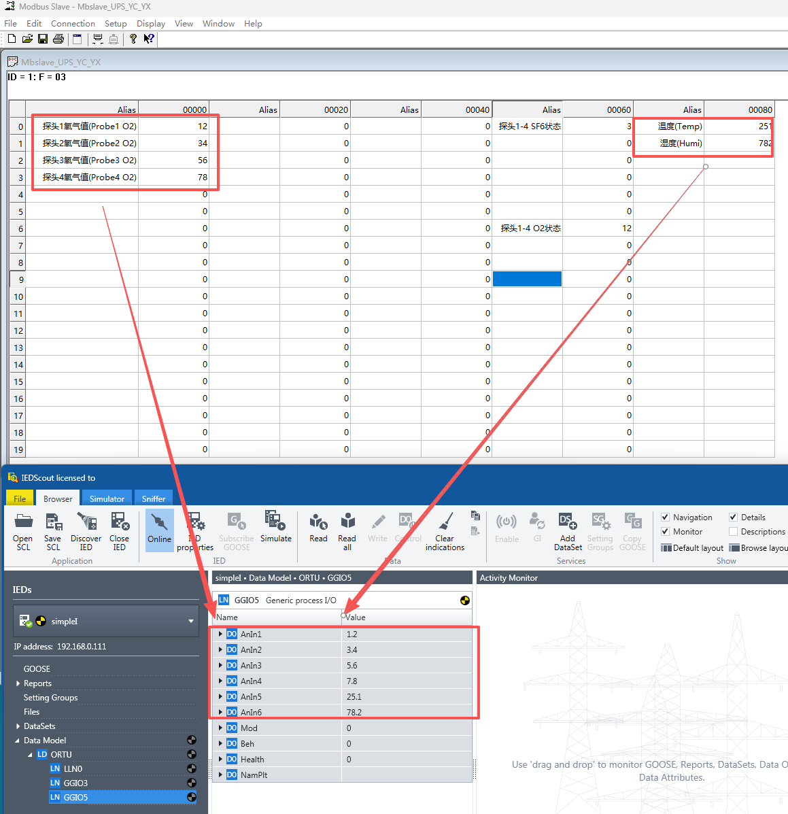
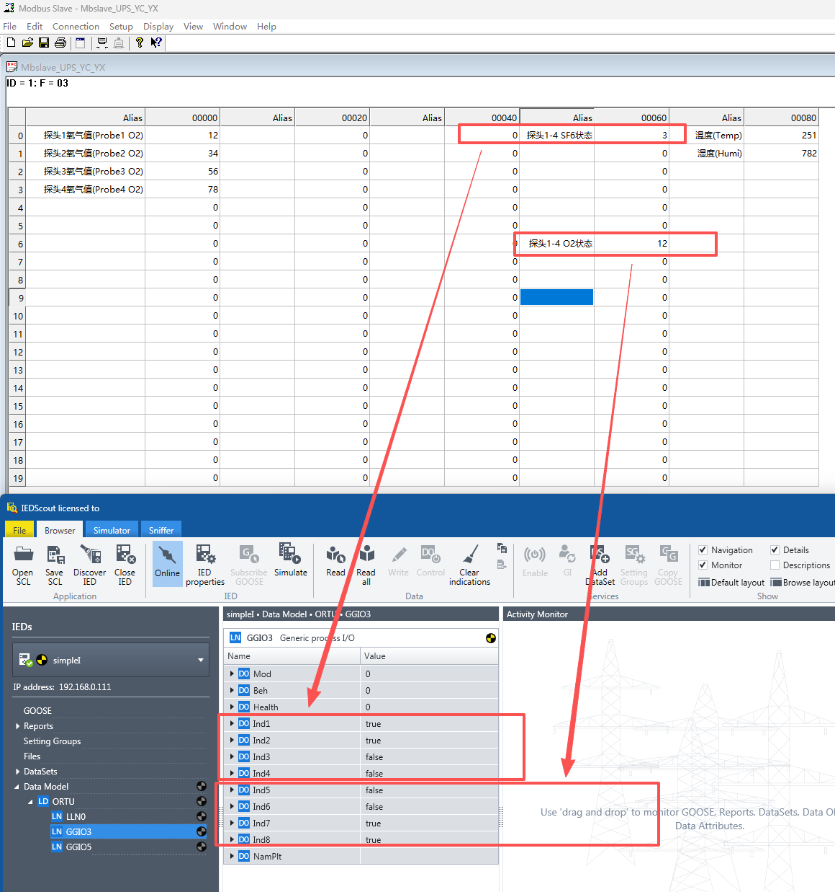

# Case Introduction (SF6 Sensor)

## 1. Function Implementation

Collect data from a relatively complex RS485 interface SF6 sensor (Sulfur Hexafluoride), and report to the 61850 master station.
> This SF6 sensor device contains two types of data points: telemetry type (integer or floating point) and telesignaling type (status bit 0/1), so we need two device models: YC_RM telemetry and YX_RS telesignaling. However, this device has a special characteristic where its status bit information is also stored in holding registers (16-bit length), occupying specific bits. For details, please refer to the Modbus data point table below.

## 2. Device RS485 Communication Parameters

SF6 Sensor Device No.1: 9600 baud, no parity, 1 stop bit

## 3. Device Modbus Data Point Table

### The following data points use Modbus 03 Read Holding Registers function code

|Data Point Address|Name|Modbus Data Type|Additional Notes|61850 Data Type|
|:----|:----|:----|:----|:----|
|0000H|Probe 1 Oxygen Value|U_AB (16-bit unsigned integer)|Integer divided by 10, unit: 0.1PPM| YC_RM Telemetry-Float|
|0001H|Probe 2 Oxygen Value|U_AB (16-bit unsigned integer)|Integer divided by 10, unit: 0.1PPM| YC_RM Telemetry-Float|
|0002H|Probe 3 Oxygen Value|U_AB (16-bit unsigned integer)|Integer divided by 10, unit: 0.1PPM| YC_RM Telemetry-Float|
|0003H|Probe 4 Oxygen Value|U_AB (16-bit unsigned integer)|Integer divided by 10, unit: 0.1PPM| YC_RM Telemetry-Float|
|003CH|Probe 1 SF6 Status|Bool|Occupies bit 0 of 0x003C register, 0-Normal 1-Alarm| YX_RS Telesignaling-Switch|
|003CH|Probe 2 SF6 Status|Bool|Occupies bit 1 of 0x003C register, 0-Normal 1-Alarm| YX_RS Telesignaling-Switch|
|003CH|Probe 3 SF6 Status|Bool|Occupies bit 2 of 0x003C register, 0-Normal 1-Alarm| YX_RS Telesignaling-Switch|
|003CH|Probe 4 SF6 Status|Bool|Occupies bit 3 of 0x003C register, 0-Normal 1-Alarm| YX_RS Telesignaling-Switch|
|0042H|Probe 1 O2 Status|Bool|Occupies bit 0 of 0x0042 register, 0-Normal 1-Alarm| YX_RS Telesignaling-Switch|
|0042H|Probe 2 O2 Status|Bool|Occupies bit 1 of 0x0042 register, 0-Normal 1-Alarm| YX_RS Telesignaling-Switch|
|0042H|Probe 3 O2 Status|Bool|Occupies bit 2 of 0x0042 register, 0-Normal 1-Alarm| YX_RS Telesignaling-Switch|
|0042H|Probe 4 O2 Status|Bool|Occupies bit 3 of 0x0042 register, 0-Normal 1-Alarm| YX_RS Telesignaling-Switch|
|0050H|Temperature|U_AB (16-bit unsigned integer)|Integer divided by 10, unit: 0.1℃| YC_RM Telemetry-Float|
|0051H|Humidity|U_AB (16-bit unsigned integer)|Integer divided by 10, unit: 0.1%| YC_RM Telemetry-Float|

## 4. How to Use This Case

- Copy the init folder in this case to completely overwrite the init folder in the FLEXLUA_61850 software directory, then click Generate in Step 4 of the software to generate the required 3 files (main.lua, model.cfg, rtu.cid).
- The main.lua and model.cfg files need to be placed into the protocol converter through the USB-C port. The rtu.cid file can be provided to 61850 master station developers for device import.

## 5. Testing

In the test folder of this case, there are modbus slave device simulation files. If you have modbus slave and IEDScout testing tool software installed on your computer, they can be used to simulate modbus slave devices and 61850 master station software respectively to complete testing.

### Read Registers (Telemetry) Test Results

### Read Coils (Telesignaling) Test Results

