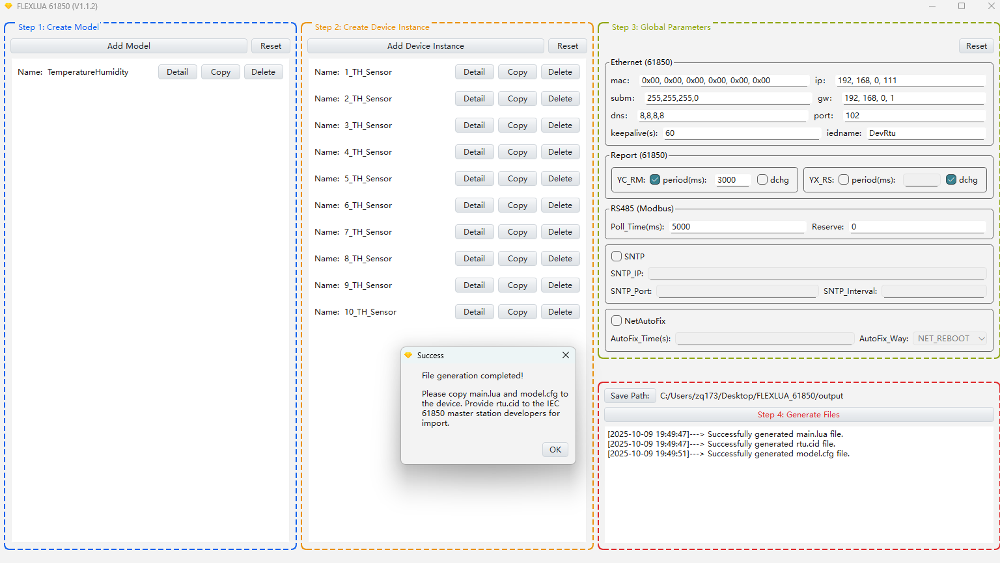

# Case Introduction (Collecting 10 Temperature & Humidity Sensors)

## 1. Function Implementation

Collect data from 10 RS485 interface temperature and humidity sensors, and report to the 61850 master station.

## 2. Device RS485 Communication Parameters

- Temperature & Humidity Sensor No.1: modbus address=1, 4800 baud, no parity, 1 stop bit
- Temperature & Humidity Sensor No.2: modbus address=2, 4800 baud, no parity, 1 stop bit
- Temperature & Humidity Sensor No.3: modbus address=3, 4800 baud, no parity, 1 stop bit
- Temperature & Humidity Sensor No.4: modbus address=4, 4800 baud, no parity, 1 stop bit
- Temperature & Humidity Sensor No.5: modbus address=5, 4800 baud, no parity, 1 stop bit
- Temperature & Humidity Sensor No.6: modbus address=6, 4800 baud, no parity, 1 stop bit
- Temperature & Humidity Sensor No.7: modbus address=7, 4800 baud, no parity, 1 stop bit
- Temperature & Humidity Sensor No.8: modbus address=8, 4800 baud, no parity, 1 stop bit
- Temperature & Humidity Sensor No.9: modbus address=9, 4800 baud, no parity, 1 stop bit
- Temperature & Humidity Sensor No.10: modbus address=10, 4800 baud, no parity, 1 stop bit

## 3. Temperature & Humidity Sensor Modbus Data Point Table

### The following data points use Modbus 03 Read Holding Registers function code

|Data Point Address|Name|Modbus Data Type|Additional Notes|61850 Data Type|
|:----|:----|:----|:----|:----|
|0000H|Humidity|S_AB (16-bit signed integer)|Integer divided by 10, unit: 0.1%| YC_RM Telemetry-Float|
|0001H|Temperature|S_AB (16-bit signed integer)|Integer divided by 10, unit: 0.1 degree| YC_RM Telemetry-Float|

## 4. How to Use This Case

- Copy the init folder in this case to completely overwrite the init folder in the FLEXLUA_61850 software directory, then click Generate in Step 4 of the software to generate the required 3 files (main.lua, model.cfg, rtu.cid).
- The main.lua and model.cfg files need to be placed into the protocol converter through the USB-C port. The rtu.cid file can be provided to 61850 master station developers for device import.

## 5. Software Configuration Completed Page

