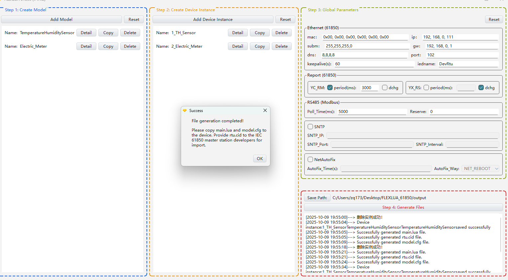

# Case Introduction (Collecting 1 Temperature Sensor and 1 Electric Meter)

## 1. Function Implementation

Collect data from 1 RS485 interface temperature and humidity sensor and 1 electric meter, and report to the 61850 master station.

## 2. Device RS485 Communication Parameters

- Temperature & Humidity Sensor No.1: modbus address=1, 4800 baud, no parity, 1 stop bit
- Electric Meter No.2: modbus address=2, 115200 baud, no parity, 1 stop bit

## 3. Temperature & Humidity Sensor Modbus Data Point Table

### The following data points use Modbus 03 Read Holding Registers function code

|Data Point Address|Name|Modbus Data Type|Additional Notes|61850 Data Type|
|:----|:----|:----|:----|:----|
|0000H|Humidity|S_AB (16-bit signed integer)|Integer divided by 10, unit: 0.1%| YC_RM Telemetry-Float|
|0001H|Temperature|S_AB (16-bit signed integer)|Integer divided by 10, unit: 0.1 degree| YC_RM Telemetry-Float|

## 4. Electric Meter Device Modbus Data Point Table

### The following data points use Modbus 03 Read Holding Registers function code

|Data Point Address|Name|Modbus Data Type|Additional Notes|61850 Data Type|
|:----|:----|:----|:----|:----|
|0064H|Line Voltage Uab|F_ABCD (32-bit float)|Keep 3 decimal places| YC_RM Telemetry-Float|
|0066H|Line Voltage Ubc|F_ABCD (32-bit float)|Keep 3 decimal places| YC_RM Telemetry-Float|
|0068H|Line Voltage Uca|F_ABCD (32-bit float)|Keep 3 decimal places| YC_RM Telemetry-Float|
|006AH|Line Voltage Average ULLAvg|F_ABCD (32-bit float)|Keep 3 decimal places| YC_RM Telemetry-Float|
|006CH|Phase Voltage Uan|F_ABCD (32-bit float)|Keep 3 decimal places| YC_RM Telemetry-Float|
|006EH|Phase Voltage Ubn|F_ABCD (32-bit float)|Keep 3 decimal places| YC_RM Telemetry-Float|
|0070H|Phase Voltage Ucn|F_ABCD (32-bit float)|Keep 3 decimal places| YC_RM Telemetry-Float|
|0072H|Phase Voltage Average ULNavg|F_ABCD (32-bit float)|Keep 3 decimal places| YC_RM Telemetry-Float|
|0074H|Current Ia|F_ABCD (32-bit float)|Keep 3 decimal places| YC_RM Telemetry-Float|
|0076H|Current Ib|F_ABCD (32-bit float)|Keep 3 decimal places| YC_RM Telemetry-Float|
|0078H|Current Ic|F_ABCD (32-bit float)|Keep 3 decimal places| YC_RM Telemetry-Float|
|007AH|Three-Phase Current Average IAvg|F_ABCD (32-bit float)|Keep 3 decimal places| YC_RM Telemetry-Float|
|007CH|Zero Sequence Current In|F_ABCD (32-bit float)|Keep 3 decimal places| YC_RM Telemetry-Float|
|007EH|Line Frequency F|F_ABCD (32-bit float)|Keep 3 decimal places| YC_RM Telemetry-Float|
|0080H|Total Power Factor PF|F_ABCD (32-bit float)|Keep 3 decimal places| YC_RM Telemetry-Float|
|0082H|Total Active Power P|F_ABCD (32-bit float)|Keep 3 decimal places| YC_RM Telemetry-Float|
|0084H|Total Reactive Power Q|F_ABCD (32-bit float)|Keep 3 decimal places| YC_RM Telemetry-Float|
|0086H|Total Apparent Power S|F_ABCD (32-bit float)|Keep 3 decimal places| YC_RM Telemetry-Float|
|0088H|Phase A Power Factor PFa|F_ABCD (32-bit float)|Keep 3 decimal places| YC_RM Telemetry-Float|
|008AH|Phase B Power Factor PFb|F_ABCD (32-bit float)|Keep 3 decimal places| YC_RM Telemetry-Float|
|008CH|Phase C Power Factor PFc|F_ABCD (32-bit float)|Keep 3 decimal places| YC_RM Telemetry-Float|
|008EH|Phase A Active Power Pa|F_ABCD (32-bit float)|Keep 3 decimal places| YC_RM Telemetry-Float|
|0090H|Phase B Active Power Pb|F_ABCD (32-bit float)|Keep 3 decimal places| YC_RM Telemetry-Float|
|0092H|Phase C Active Power Pc|F_ABCD (32-bit float)|Keep 3 decimal places| YC_RM Telemetry-Float|
|0094H|Phase A Reactive Power Qa|F_ABCD (32-bit float)|Keep 3 decimal places| YC_RM Telemetry-Float|
|0096H|Phase B Reactive Power Qb|F_ABCD (32-bit float)|Keep 3 decimal places| YC_RM Telemetry-Float|
|0098H|Phase C Reactive Power Qc|F_ABCD (32-bit float)|Keep 3 decimal places| YC_RM Telemetry-Float|
|009AH|Phase A Apparent Power Sa|F_ABCD (32-bit float)|Keep 3 decimal places| YC_RM Telemetry-Float|
|009CH|Phase B Apparent Power Sb|F_ABCD (32-bit float)|Keep 3 decimal places| YC_RM Telemetry-Float|
|009EH|Phase C Apparent Power Sc|F_ABCD (32-bit float)|Keep 3 decimal places| YC_RM Telemetry-Float|

## 4. How to Use This Case

- Copy the init folder in this case to completely overwrite the init folder in the FLEXLUA_61850 software directory, then click Generate in Step 4 of the software to generate the required 3 files (main.lua, model.cfg, rtu.cid).
- The main.lua and model.cfg files need to be placed into the protocol converter through the USB-C port. The rtu.cid file can be provided to 61850 master station developers for device import.

## 5. Software Configuration Completed Page

